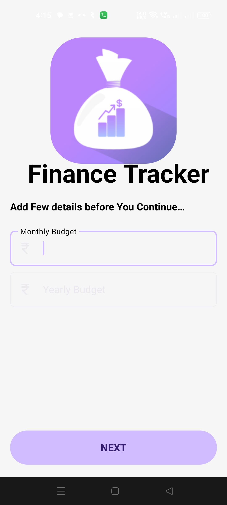
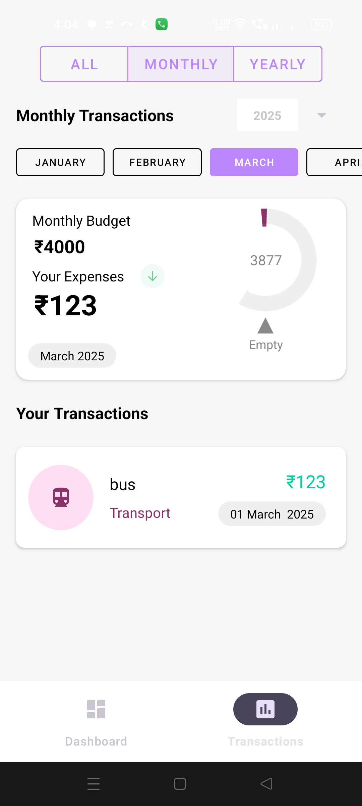
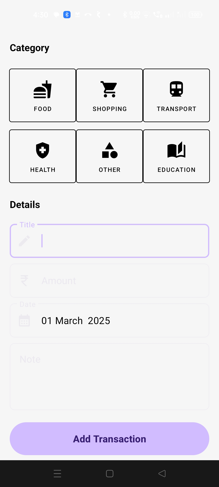
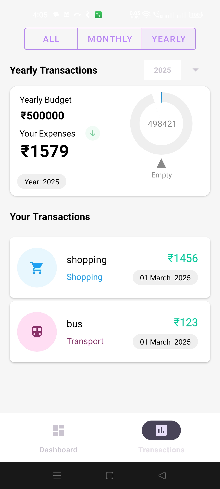

# 📊 Personal Finance Tracker App  
A simple **Android app** to track expenses, set budgets, and visualize spending trends. Built using **XML, Room Database, and MPAndroidChart**.

---

## 📌 Features  

### 💰 Expense Management  
- ✅ Add, edit, and delete expenses  
- ✅ Categorize expenses (Food, Transport, Bills, etc.)  
  

### 📊 Budgeting & Insights  
- ✅ Set monthly budgets per category  
- ✅ Track total spending vs. budget  

### 📈 Data Visualization  
- ✅ Interactive charts with **MPAndroidChart**  
- ✅ Spending breakdown by category  
- ✅ Weekly & monthly spending trends  

### 💾 Data Persistence  
- ✅ Uses **Room Database** to store expenses  

### 🎨 UI/UX  
- ✅ Material Design with XML-based UI  
- ✅ **Bottom Navigation** for easy navigation  
- ✅ **Floating Action Button (FAB)** for quick expense entry  

---

## 🛠 Tech Stack  
✅ **Language:** Kotlin  
✅ **Architecture:** MVVM (Model-View-ViewModel)  
✅ **UI:** XML-based, Material Design  
✅ **Navigation:** Bottom Navigation View  
✅ **Database:** Room Database (SQLite)  
✅ **Charts:** MPAndroidChart
✅ **Dependency Injection:** ViewModelProvider Factory  
✅ **Coroutines & LiveData** for async operations  

